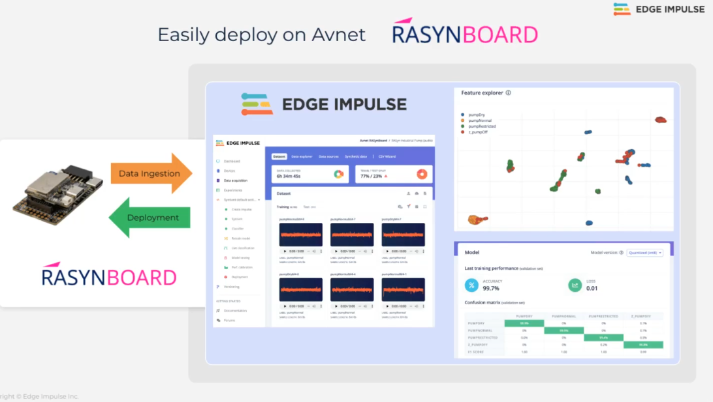

Signal Processing for Interactive Systems
=========================================

Extracting meaningful features from your data is crucial to building small and reliable machine learning models.

On [Edge Impulse this is done through processing blocks](https://docs.edgeimpulse.com/docs/edge-impulse-studio/processing-blocks): a number of processing blocks for common sensor data (such as vibration and audio).

* [Raw Data](https://docs.edgeimpulse.com/docs/edge-impulse-studio/processing-blocks/raw)
* [Flatten](https://docs.edgeimpulse.com/docs/edge-impulse-studio/processing-blocks/flatten)
* [Image](https://docs.edgeimpulse.com/docs/edge-impulse-studio/processing-blocks/image)
* [Spectral features](https://docs.edgeimpulse.com/docs/edge-impulse-studio/processing-blocks/spectral-features)
* [Spectrogram](https://docs.edgeimpulse.com/docs/edge-impulse-studio/processing-blocks/spectrogram)
* [Audio MFE](https://docs.edgeimpulse.com/docs/edge-impulse-studio/processing-blocks/audio-mfe)
* [Audio MFCC](https://docs.edgeimpulse.com/docs/edge-impulse-studio/processing-blocks/audio-mfcc)
* [Audio Syntiant](https://docs.edgeimpulse.com/docs/edge-impulse-studio/processing-blocks/audio-syntiant)
* [IMU Syntiant](https://docs.edgeimpulse.com/docs/edge-impulse-studio/processing-blocks/imu-syntiant)
* [HR/HRV features](https://docs.edgeimpulse.com/docs/edge-impulse-studio/processing-blocks/hr-hrv-features)

The source code of these blocks are available in the [Edge Impulse processing blocks GitHub repository](https://github.com/edgeimpulse/processing-blocks).

# Custom processing blocks

If you have a very specific sensor, want to apply custom filters, or are implementing the latest research in digital signal processing, follow the [Edge Impulse tutorial on Building custom processing blocks](https://github.com/edgeimpulse/processing-blocks).

**To pass SPIS, you will program your own custom DSP block, fine-tune and apply it to a specific problem and deliver eihter as a notebook or as an Edge Impulse block.** The application could be either your own problem (classical mini-project) or a hackathon (TBA). The total duration of the work is about 30 hours (2 ECTS).
