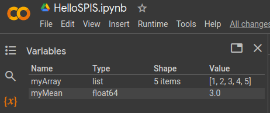
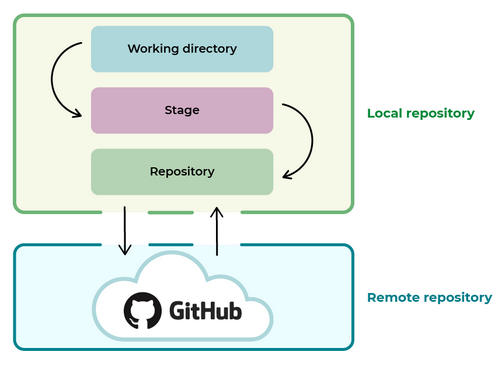
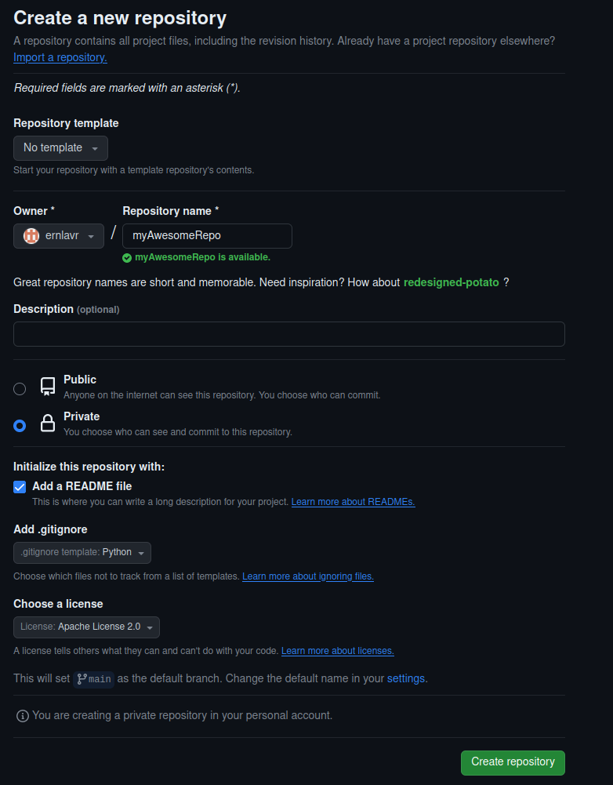
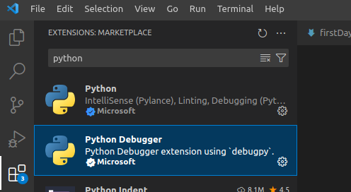

# Introduction: Programming tools and environmets

This handout is to help you navigate and kick-off your Python development journey by using modern workflows. It is oriented towards beginners; advanced students may skip some parts, but use this handout as a cheat-sheet or a refresher!

## List of learning outcomes

1. Familiarization with Google Colab
2. Learning basics of Git (most popular commands) and understanding the
   core workflow (local-remote repository)
3. Using Google Colab with Git
4. Modern Python development workflows (virtual environments)
5. Development tools (VSCode, GitHub Copilot)

# Google Colab

Google Colab[^1] is a browser-based Python notebook[^2] programming environment, meaning that you can execute Python code and write *Markdown* format text in a *cell-based* environment[^3]. The easiest way of using Colab is by having a Google account and saving your *notebook (.ipynb)* files on your Google Drive, although later we'll see that this is not the most optimal way of working.

The code is executed on Google's cloud hardware, this has an added benefit of giving you limited but free available GPU resources. As of writing this handout, the code is executed with Python 3.10.

## Example Notebook

Open the attached *HelloSPIS.ipynb* notebook in Colab and go through the following steps.

1. Open Colab and upload the notebook. *File → Open Notebook → Upload*.
2. Execute each cell with *Ctrl + Shift*
3. Execute all cells *Runtime → Run All (Ctrl + F9)*
4. Enable free GPU acceleration. *Runtime → Change Runtime Type → Select your Hardware Acceleration (T4)*. Useful for any GPU acceleration base applications, e.g. machine learning.
5. Insert a new *code* cell. Click where you want to insert it and *Ctrl + M + B*
6. Observe your current variable states. See Figure [1](#fig:state)

# Git and GitHub

**Git** is a code version control system developed by Linus Torvalds (maker of Linux kernel). It essentially allows you to manage your code into specific snapshots, create a development history and colaborate with other developers.

**GitHub**, on the other hand, is a product owned by Microsoft that wraps some of the Git functionality with a nice user interface, provides storage space for countless code repositories and integrates other useful *DevOps* features.

So for this part, please install Git[^4] locally on your computer (default settings will work just fine!) and create a GitHub account[^5].  Git is an industry-standard tool and there are good reasons why everyone uses it, if you are serious about programming then you should get comfortable with it throughout your time in university.

## One Bit of Theory

A benefit of Git is its decentralized way of working. This means that every time you *clone* a Git repository, you capture a snapshot from a *remote* server (e.g. GitHub). This creates a *local* repository on your computer where you do your code development. As you make changes in your *working directory*, you will end-up creating snapshots called *commits*. These *commits* are saved to the *local repository* to form a history that can be used as progress reports, documentation and history to which also present states of the codebase can also be reverted to.  Finally, once you are ready to publish your changes, you *push* them to the remote repository.

Git is a very powerful and complex tool with many advanced features,
although as an individual developer or a colaborator within a small
group (e.g. university project group), about 95% of your time you will
end up using just a small subset of its features. Although the best way
to learn Git is by using it, it could be beneficial for you to read-up
on the commands in Figure [3](#fig:gitCheatSheet).
Otherwise, feel free to look up any
other cheat sheets just by Google searching for them!

## Using SSH keys within Git

SSH is used for security within an internet environment. For GitHub to
know that the person pushing the changes is really you, it needs to use
SSH keys as a form of identification. Creating and adding them to your
account should be straight forward, just follow this[^6] guide for
creating a key, and this[^7] guide for connecting your key to your
account. If you encounter issues, just remember that Google is your best
friend!

## Your First Repository and Commit

When navigating Git, we recommend getting used-to using the command
terminal, eventually you will find it more straight forward to use than
UI based applications. There are multiple reasons why using the terminal
is beneficial, among which is the simplicity of executing a text-based
command. If you ever will need to get help, or help others, text-based
commands will be the most straight-forward and easiest way to
communicate and accept the information.

That being said, fire up your terminal! Upon successful Git
installation, on Mac and Linux, you should have Git added to your
standard terminal. On Windows you would need to *Right-Click*[^8] in a
folder and click *Git Bash here*.

1. Open GitHub website on your browser and click the *New* button to
   create a new repository, see Figure
   [4](#fig:gitRepo)
2. Go through the steps of creating a new repository. The important
   part is to add a relevant *.gitignore* template and decide if you
   want the repository *public* or *private*, the rest is up to you.
   See Figure [5](#fig:gitRepoSettings)
3. Your browser should automatically navigate you to your new
   repository. Click the green *Code* button and copy the link from the
   SSH tab.
4. Navigate to your Git terminal and issues *'git clone YOUR_LINK'*
   command
5. This now should download the repository on your computers. Take the
   *HelloSPIS.ipynb* file from the Section
   [2](#sect:gcolab) and copy it in the newly created directory.
   *Note:* You can navigate the terminal environment with *cd myAwesomeRepo* to enter your repository (or any other folder), use *ls* to view the contents, use *cd ..* to go one folder up.
6. Issue *cd myAwesomeRepo* to enter the repository in the terminal
   environment and issues *git status*. You should see that you have an
   *untracked file*. This means that this file is completely new to
   your repository.
7. Add your file to *staging*. Issue the command *git add
   HelloSPIS.ipynb*. Note: to speed up your work, you can press *TAB*
   key to autocomplete partially written file names, i.e. *git add
   Hel* + TAB should autocomplete the file name. This works only if the
   file name can be resolved to a single file.
8. Make a *commit* to your *local* repository. Issue the command *git
   commit -m \"add helloSPIS\"*. It is good practice to use short and
   explicit messages, this will be useful if you ever need to review
   the history!
9. Now *push* your file to GitHub. Issue the command *git push*, you
   may be prompted for a password. Once this is complete, go back to
   GitHub and notice how your file is added to the remote server!
10. Optional: Make a code edit to the file and repeat through steps 6-9,
    you can also use *git diff* to see your performed changes.

## Git Development Branches

One of the most common features used during development is *branching*.
This essentially means that you divert your future *commits* to a
separate environment within Git called a *branch*. In practice, this
isolates your *state-of-the-art* codebase (main branch) from your
*prototyping* codebase (development branch). This feature is critical
because you do not want to potentially break or pollute your most
recent, working codebase with experimental code that may not be fully
tested or developed. Let's take a look at this feature!

1. Open your Git terminal and issue *git checkout -b
   \"median_computation\"*. In the next section, you will add a simple
   one line of code for computing the median.
2. Issue the command *git push --set-upstream origin
   median_computation*. This will do two things at once, push the newly
   created branch to the remote repository and set it as an upstream
   branch, meaning that all future commits will be pushed to it. Note:
   You can use *git branch*, *git branch --remote* and *git checkout
   BRANCH_NAME* to view local, remote branches and switch to a new
   branch.
3. Take a look at your repository on GitHub website. You can expand the
   branch dropdown and should see your newly created branch there. See
   Figure [6](#fig:gitBranch).

# Google Colab and Git

In Section [2](#sect:gcolab) we were developing code right within our
Google Drive. While it works for quick checks, generally this is an
awful way of working because you end up with scattered files and a poor
development history. In this segment, we will read a notebook directly
from a Git repository and save changes back into Git.

1. Navigate back to Google Colab and hit *File → Open Notebook →
   GitHub Tab*. Enter your Git username, depending on if you made your
   repository *private* during Section
   [3](#sect:git), you need
   to enable *private repositories* and a pop-up should appear for
   authentication. See Figure
   [7](#fig:gitInColab)
2. You should see your Notebook file become available. Make sure to
   select the correct branch and open the file.
3. Make a change to the codebase, e.g. compute the median with
   *np.median()* function and print out the value.
4. Navigate to *File → Save as Copy to GitHub*, select the
   ***median_computation* branch** that was created in Section
   [3.4](#subsect:gitDevBranch), enter a relevant commit message
   and hit OK! See Figure
   [8](#fig:gitInColab_commit).
5. Open up GitHub website and notice that a new change has been added
   to the file! Note: make sure you're viewing the correct branch.
6. *Many Bonus Points:* Navigate back to your repository within your
   Git terminal and issue *git pull* command to pull now the latest
   changes from the GitHub website. Congrats!!

# Python, VSCode and Virtual Environments

## Virtual Environments

Throughout your Python development journey, you will end up working on multiple different projects that have their own unique demands and external dependencies (Python packages). While one-time simple prototyping may get you away with using standard Python and its *pip* package manager, a more robust and industry-standard workflow is by using virtual environments. Virtual environments is a way to isolate your Python package installations into separate, independent *boxes*.  This can help you avoid dependency collisions in cases where different packages may require different versions of sub-packages, while you may not experience this is you use most mainstream packages such as *Matplotlib, Pandas, Numpy*, if you end up running either experimental legacy code, or using something more exotic, there may be requirements for particular versions. This is where **Conda** comes into play.

**Conda** is a virtual environment tool that has a multitude of different flavours such as *Anaconda (the giant), Conda-forge (community supported packages), Miniconda (a canonical version of Anaconda), Miniforge* and possibly others. The core functionality of it is the same, they just come with different preset configurations. When you install Python packages, *Conda* will automatically solve (cross-check) the package versions to prevent collisions and refuse to install if there is a risk of breaking your environment. Besides isolating your Python environments, *Conda* is also highly beneficial for managing your Python versions. Want to use Python 3.10, 3.9 or 3.12? No problem! Just specify your Python version as a parameter upon creation of your environment!

### Customizations: Miniforge and Mamba

To start off, please use this[^9] guide to install your Miniconda environment. Default settings will work just fine. Afterwards, if you use Mac or Linux, your Conda environment should be accessible via your standard terminal. If on Windows, search for *Miniconda prompt* within your search bar. Type *conda --version* in the terminal to cross-check that it has installed correctly. If all looks good, then continue on with the handout, otherwise try Googling and troubleshooting your problem.

Note: If you see a message *Conda command not found* after installation.  Try this guide [^10]. Dont forget to swap out all *anaconda* related things with *miniconda*.

### Conda Base

You can activate Conda by typing *conda activate*. Your terminal should afterward contain the *base*, see Figure [9](#fig:condaAct). *Base* is your parent environment from which all further environments will be *branched* off from. **Do not install packages in your base environment!** Base environment should be kept clean and minimal because your development environments will be based off it, there are very rare cases when you should install packages in your base environment, one of which is covered in the next section.

### Mamba

Mamba is a C++ ported implementation of Conda which means that it is **a
lot** faster than Miniforge. Additionally, it has an implementation for
package caching, so you end up saving space on your computer.

Mamba can be installed in your *Base* environment because then you will
be able to use it throughout your development environments, it can be
seen as an extension of Conda. This[^11] is your standard repository for
Conda packages, issue the command *conda install conda-forge::mamba* to
install it. **From now on, replace all future *conda XXX* commands with
*mamba XXX***.

### Your first environment

Use the supplementary *environment.yml* file to create the predefined development environment. For any further commands, consult online cheat sheets[^12]! Remember that you can replace *conda* prefix with *mamba* to use the C++ acceleration.

1. Use the command *mamba env create -f environment.yml*. Note that you
   need to navigate to the folder that contains your *environment.yml*
   file. Use *cd* and *ls* (*dir* for Windows) commands to your help!
2. Activate the environment with *mamba activate helloSpis*. The *base*
   should now change to your environment name, see Figure
   [10](#fig:condaActEnv).
3. Activate your Python interpreter via Conda by typing *python3* (or
   *python* on Windows). You should see **Python version 3.10**.
4. Import Numpy as a validation step. Type *import numpy*. If you see
   an error, then you've made a mistake in one of the steps above.

**Optional:** Here are steps for creating an environment from scratch.

1. Ensure you have **base** environment activated! Type *mamba
   deactivate* to exit your development environment
2. Create an environment with *mamba create --name myEnvironment
   python=3.10*. *Note*: The Python version specification is optional,
   you can leave that out to use the latest Python or change it to a
   different version.
3. Activate your environment *mamba activate myEnvironment*
4. Install any packages you'd like. Try searching and installing Numpy
   from here https://anaconda.org/ the installation command will be
   accompanied in the package page.

### Your first environment 
1. Use the command `mamba env create -n myFirst`

2. Activate the environment with `mamba activate myFirst`. 
   The *base* shell prompt 
   should now change to your environment name "myFirst".
   See Figure [10](#fig:condaActEnv).

3. Activate your Python interpreter via Conda by typing *python* 

4. Import Numpy as a validation step. Type *import numpy*. 
   If you see an error, then you've made a mistake in one of the steps above.

### Optional: Your first managed environment

First, you can create / manage environments from VSCode. Then, you can customize the package versions in your environments. To do this, please use the supplementary *environment.yml* file to create the predefined development environment. For any further commands, consult online cheat sheets[^12]! Remember that you can replace *conda* prefix with *mamba* to use the C++ acceleration.

1. Use the command *mamba env create -f environment.yml*. Note that you need to navigate to the folder that contains your *environment.yml* file. Use *cd* and *ls* (*dir* for Windows) commands to your help!

2. Activate the environment with *mamba activate helloSpis*. The *base*
   should now change to your environment name, see Figure
   [10](#fig:condaActEnv).
3. Activate your Python interpreter via Conda by typing *python3* (or
   *python* on Windows). You should see **Python version 3.10**.
4. Import Numpy as a validation step. Type *import numpy*. If you see
   an error, then you've made a mistake in one of the steps above.

**Optional:** Here are steps for creating an environment from scratch.

1. Ensure you have **base** environment activated! Type *mamba
   deactivate* to exit your development environment
2. Create an environment with *mamba create --name myEnvironment
   python=3.10*. *Note*: The Python version specification is optional,
   you can leave that out to use the latest Python or change it to a
   different version.
3. Activate your environment *mamba activate myEnvironment*
4. Install any packages you'd like. Try searching and installing Numpy
   from here https://anaconda.org/ the installation command will be
   accompanied in the package page.

## Python Development and VSCode

Fundamentally, it is up to you what text editor you use and how you set up your development environment. Many bloggers will have trivial conversations over *what code editor to use* and *which code editor is the best*. We recommend VSCode because of it high flexibility, usability and integrations of useful development plugins. In this section we will link up your Python virtual environment with VSCode and execute your favorite Jupyter Notebook *helloSpis.ipynb*.

1. Download and install VSCode [^13]. Default settings will work just
   fine!
2. Open up VSCode and navigate to *Extensions* tab. See Figure
   [11](#fig:vsCodeExtn).
3. Install the following extensions: *Python, Python Debugger, Jupyter*
4. Open the *HelloSPIS.ipynb* notebook and comment-out the *pip*
   package installation command from the first cell, and select your
   *helloSpis* Conda environment (see top-right corner of Figure
   [12](#fig:jupyterInVscode)). The notebook should look similar
   as in Figure [12](#fig:jupyterInVscode)}.
5. Execute the notebook by pressing *Run All*. Additionally, you can
   execute also cell-by-cell with *Shift+Enter*.

Does your virtual environment not automatically show-up in VS-Code? Try these steps to point to it manually.

1. Open your command-pallette (Ctrl + shift + P) and locate *Python:
   select interpreter*.
2. Locate your virtual environment, Python3 binary. On Unix (Mac/Linux)
   it should be in
   */home/USER_NAME/miniforge3/envs/helloSpis/bin/python3*
3. On Windows
   *C:/Users/username/Miniforge3/envs/helloSpis/bin/python.exe*
4. Select it and try rerunning the code. If this does not work, use
   Google to troubleshoot.

## Optional: GitHub Copilot

Github copilot is an aid for programmers that provides you with code suggestions based on context and comments. It essentially acts as a clever *auto-fill*. While we do not prevent you from using it, if you are a beginner programmer it will be beneficial for you to write-out code yourself and learn to solve, troubleshoot and debug manually, purely for learning purposes. Nevertheless, Copilot is a great tool and independent of your experience, you should be aware of it.

See an installation and introduction guide here[^14]. On VS-Code you'll need to install the Copilot extension.

Happy coding! :-)

# References

[^1]: https://colab.research.google.com/
    
[^2]: Some of you may know this workflow format as \"Jupyter Notebook\"
    
[^3]: Meaning that code is structured into chunks and executed
       chunk-by-chunk
    
[^4]: https://git-scm.com/
    
[^5]: Github https://github.com/
    
[^6]: https://docs.github.com/en/authentication/connecting-to-github-with-ssh/generating-a-new-ssh-key-and-adding-it-to-the-ssh-agent?platform=windows
    
[^7]: https://docs.github.com/en/authentication/connecting-to-github-with-ssh/adding-a-new-ssh-key-to-your-github-account
    
[^8]: On Windows 11 you may need to expand further to *Show More
       Options*
    
[^9]: https://conda-forge.org/download/
    
[^10]: https://saturncloud.io/blog/solving-the-conda-command-not-found-issue-after-installing-anaconda3/
    
[^11]: https://anaconda.org/conda-forge/mamba
    
[^12]: https://docs.conda.io/projects/conda/en/4.6.0/\_downloads/52a95608c49671267e40c689e0bc00ca/conda-cheatsheet.pdf
    
[^13]: https://code.visualstudio.com/
    
[^14]: https://github.com/features/copilot
