# DSP Spectral Features

![DALL·E 3 Prompt: 1950s style cartoon illustration of a Latin male and female scientist in a vibration research room. The man is using a calculus ruler to examine ancient circuitry. The woman is at a computer with complex vibration graphs. The wooden table has boards with sensors, prominently an accelerometer. A classic, rounded-back computer shows the Arduino IDE with code for LED pin assignments and machine learning algorithms for movement detection. The Serial Monitor displays FFT, classification, wavelets, and DSPs. Vintage lamps, tools, and charts with FFT and Wavelets graphs complete the scene.](images/jpg/dsp_ini.jpg)

## Overview

TinyML projects related to motion (or vibration) involve data from IMUs (usually **accelerometers** and **Gyroscopes**). These time-series type datasets should be preprocessed before inputting them into a Machine Learning model training, which is a challenging area for embedded machine learning. Still, Edge Impulse helps overcome this complexity with its digital signal processing (DSP) preprocessing step and, more specifically, the [Spectral Features Block](https://docs.edgeimpulse.com/docs/edge-impulse-studio/processing-blocks/spectral-features) for Inertial sensors.

But how does it work under the hood? Let's dig into it.

## Extracting Features Review

Extracting features from a dataset captured with inertial sensors, such as accelerometers, involves processing and analyzing the raw data. Accelerometers measure the acceleration of an object along one or more axes (typically three, denoted as X, Y, and Z). These measurements can be used to understand various aspects of the object's motion, such as movement patterns and vibrations. Here's a high-level overview of the process:

**Data collection:** First, we need to gather data from the accelerometers. Depending on the application, data may be collected at different sampling rates. It's essential to ensure that the sampling rate is high enough to capture the relevant dynamics of the studied motion (the sampling rate should be at least double the maximum relevant frequency present in the signal).

**Data preprocessing:** Raw accelerometer data can be noisy and contain errors or irrelevant information. Preprocessing steps, such as filtering and normalization, can help clean and standardize the data, making it more suitable for feature extraction.

> The Studio does not perform normalization or standardization, so sometimes, when working with Sensor Fusion, it could be necessary to perform this step before uploading data to the Studio. This is particularly crucial in sensor fusion projects, as seen in this tutorial, [Sensor Data Fusion with Spresense and CommonSense](https://docs.edgeimpulse.com/experts/air-quality-and-environmental-projects/environmental-sensor-fusion-commonsense).

**Segmentation:** Depending on the nature of the data and the application, dividing the data into smaller segments or **windows** may be necessary. This can help focus on specific events or activities within the dataset, making feature extraction more manageable and meaningful. The **window size** and overlap (**window span**) choice depend on the application and the frequency of the events of interest. As a rule of thumb, we should try to capture a couple of "data cycles."

**Feature extraction:** Once the data is preprocessed and segmented, you can extract features that describe the motion's characteristics. Some typical features extracted from accelerometer data include:

- **Time-domain** features describe the data's [statistical properties](https://www.mdpi.com/1424-8220/22/5/2012) within each segment, such as mean, median, standard deviation, skewness, kurtosis, and zero-crossing rate.
- **Frequency-domain** features are obtained by transforming the data into the frequency domain using techniques like the [Fast Fourier Transform (FFT)](https://en.wikipedia.org/wiki/Fast_Fourier_transform). Some typical frequency-domain features include the power spectrum, spectral energy, dominant frequencies (amplitude and frequency), and spectral entropy.
- **Time-frequency** domain features combine the time and frequency domain information, such as the [Short-Time Fourier Transform (STFT)](https://en.wikipedia.org/wiki/Short-time_Fourier_transform) or the [Discrete Wavelet Transform (DWT)](https://en.wikipedia.org/wiki/Discrete_wavelet_transform). They can provide a more detailed understanding of how the signal's frequency content changes over time.

In many cases, the number of extracted features can be large, which may lead to overfitting or increased computational complexity. Feature selection techniques, such as mutual information, correlation-based methods, or principal component analysis (PCA), can help identify the most relevant features for a given application and reduce the dimensionality of the dataset. The Studio can help with such feature-relevant calculations.

Let's explore in more detail a typical TinyML Motion Classification project covered in this series of Hands-Ons.

## A TinyML Motion Classification project


In the hands-on project, *Motion Classification and Anomaly Detection*, we simulated mechanical stresses in transport, where our problem was to classify four classes of movement:

- **Maritime** (pallets in boats)
- **Terrestrial** (pallets in a Truck or Train)
- **Lift** (pallets being handled by Fork-Lift)
- **Idle** (pallets in Storage houses)

The accelerometers provided the data on the pallet (or container).

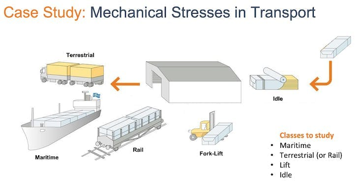

Below is one sample (raw data) of 10 seconds, captured with a sampling frequency of 50Hz:

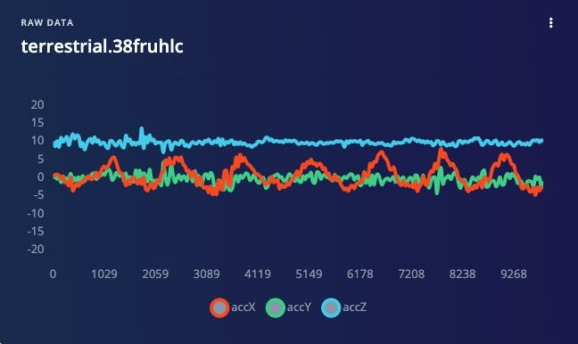

> The result is similar when this analysis is done over another dataset with the same principle, using a different sampling frequency, 62.5Hz instead of 50Hz.

## Data Pre-Processing

The raw data captured by the accelerometer (a "time series" data) should be converted to "tabular data" using one of the typical Feature Extraction methods described in the last section.

We should segment the data using a sliding window over the sample data for feature extraction. The project captured accelerometer data every 10 seconds with a sample rate of 62.5 Hz. A 2-second window captures 375 data points (3 axis x 2 seconds x 62.5 samples). The window is slid every 80ms, creating a larger dataset where each instance has 375 "raw features."

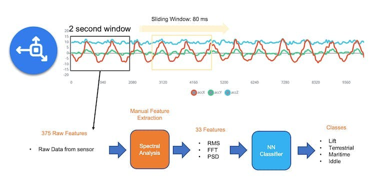

On the Studio, the previous version (V1) of the **Spectral Analysis Block** extracted as time-domain features only the RMS, and for the frequency-domain, the peaks and frequency (using FFT) and the power characteristics (PSD) of the signal over time resulting in a fixed tabular dataset of 33 features (11 per each axis),

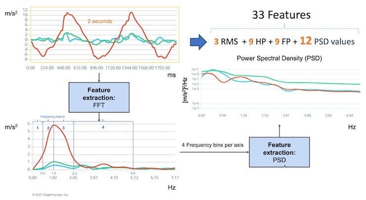

Those 33 features were the Input tensor of a Neural Network Classifier.

In 2022, Edge Impulse released version 2 of the Spectral Analysis block, which we will explore here.

### Edge Impulse - Spectral Analysis Block V.2 under the hood

In Version 2, Time Domain Statistical features per axis/channel are:

- RMS
- Skewness
- Kurtosis

And the Frequency Domain Spectral features per axis/channel are:

- Spectral Power
- Skewness (in the next version)
- Kurtosis (in the next version)

In this [link,](https://docs.edgeimpulse.com/docs/edge-impulse-studio/processing-blocks/spectral-features) we can have more details about the feature extraction.

> Clone the [public project](https://studio.edgeimpulse.com/public/198358/latest). You can also follow the explanation, playing with the code using my Google CoLab Notebook: [Edge Impulse Spectral Analysis Block Notebook](https://colab.research.google.com/github/SMC-AAU-CPH/SPIS/blob/main/04-SharedLab/Edge_Impulse_Spectral_Analysis_Block_V3.ipynb).

Start importing the libraries:

```python
import numpy as np
import matplotlib.pyplot as plt
import seaborn as sns
import math
from scipy.stats import skew, kurtosis
from scipy import signal
from scipy.signal import welch
from scipy.stats import entropy
from sklearn import preprocessing
import pywt

plt.rcParams['figure.figsize'] = (12, 6)
plt.rcParams['lines.linewidth'] = 3
```

From the studied project, let's choose a data sample from accelerometers as below:

- Window size of 2 seconds: `[2,000]` ms
- Sample frequency: `[62.5]` Hz
- We will choose the `[None]` filter (for simplicity) and a
- FFT length: `[16]`.

```python
f =  62.5 # Hertz
wind_sec = 2 # seconds
FFT_Lenght = 16
axis = ['accX', 'accY', 'accZ']
n_sensors = len(axis)
```

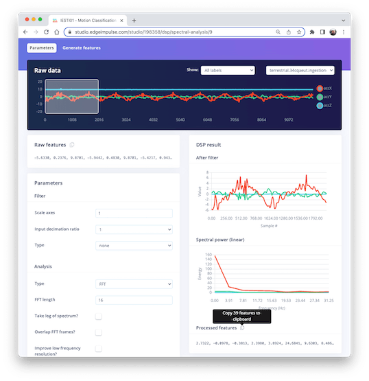

Selecting the *Raw Features* on the Studio Spectral Analysis tab, we can copy all 375 data points of a particular 2-second window to the clipboard.


Paste the data points to a new variable *data*:

```python
data=[-5.6330, 0.2376, 9.8701, -5.9442, 0.4830, 9.8701, -5.4217, ...]
No_raw_features = len(data)
N = int(No_raw_features/n_sensors)
```

The total raw features are 375, but we will work with each axis individually, where N= 125 (number of samples per axis).

We aim to understand how Edge Impulse gets the processed features.


So, you should also past the processed features on a variable (to compare the calculated features in Python with the ones provided by the Studio) :

```python
features = [2.7322, -0.0978, -0.3813, 2.3980, 3.8924, 24.6841, 9.6303, ...]
N_feat = len(features)
N_feat_axis = int(N_feat/n_sensors)
```

The total number of processed features is 39, which means 13 features/axis.

Looking at those 13 features closely, we will find 3 for the time domain (RMS, Skewness, and Kurtosis):

- `[rms] [skew] [kurtosis]`

and 10 for the frequency domain (we will return to this later).

- `[spectral skew][spectral kurtosis][Spectral Power 1] ... [Spectral Power 8]`

**Splitting raw data per sensor**

The data has samples from all axes; let's split and plot them separately:

```python
def plot_data(sensors, axis, title):
    [plt.plot(x, label=y) for x,y in zip(sensors, axis)]
    plt.legend(loc='lower right')
    plt.title(title)
    plt.xlabel('#Sample')
    plt.ylabel('Value')
    plt.box(False)
    plt.grid()
    plt.show()

accX = data[0::3]
accY = data[1::3]
accZ = data[2::3]
sensors = [accX, accY, accZ]
plot_data(sensors, axis, 'Raw Features')
```

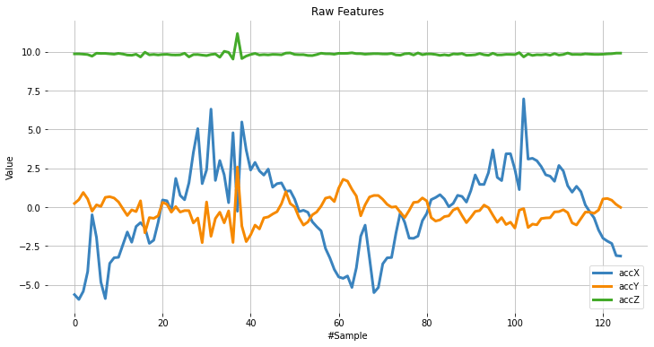

**Subtracting the mean**

Next, we should subtract the mean from the *data*. Subtracting the mean from a data set is a common data pre-processing step in statistics and machine learning. The purpose of subtracting the mean from the data is to center the data around zero. This is important because it can reveal patterns and relationships that might be hidden if the data is not centered.

Here are some specific reasons why subtracting the mean can be helpful:

- It simplifies analysis: By centering the data, the mean becomes zero, making some calculations simpler and easier to interpret.
- It removes bias: If the data is biased, subtracting the mean can remove it and allow for a more accurate analysis.
- It can reveal patterns: Centering the data can help uncover patterns that might be hidden if the data is not centered. For example, centering the data can help you identify trends over time if you analyze a time series dataset.
- It can improve performance: In some machine learning algorithms, centering the data can improve performance by reducing the influence of outliers and making the data more easily comparable. Overall, subtracting the mean is a simple but powerful technique that can be used to improve the analysis and interpretation of data.

```python
dtmean = [(sum(x)/len(x)) for x in sensors]
[print('mean_'+x+'= ', round(y, 4)) for x,y in zip(axis, dtmean)][0]

accX = [(x - dtmean[0]) for x in accX]
accY = [(x - dtmean[1]) for x in accY]
accZ = [(x - dtmean[2]) for x in accZ]
sensors = [accX, accY, accZ]

plot_data(sensors, axis, 'Raw Features - Subctract the Mean')
```

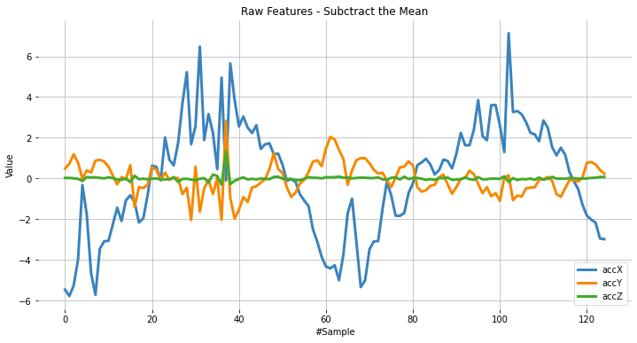

## Time Domain Statistical features

**RMS Calculation**

The RMS value of a set of values (or a continuous-time waveform) is the square root of the arithmetic mean of the squares of the values or the square of the function that defines the continuous waveform. In physics, the RMS value of an electrical current is defined as the "value of the direct current that dissipates the same power in a resistor."

In the case of a set of n values {𝑥1, 𝑥2, ..., 𝑥𝑛}, the RMS is:


> NOTE that the RMS value is different for the original raw data, and after subtracting the mean

```py
# Using numpy and standartized data (subtracting mean)
rms = [np.sqrt(np.mean(np.square(x))) for x in sensors]
```

We can compare the calculated RMS values here with the ones presented by Edge Impulse:

```python
[print('rms_'+x+'= ', round(y, 4)) for x,y in zip(axis, rms)][0]
print("\nCompare with Edge Impulse result features")
print(features[0:N_feat:N_feat_axis])
```

`rms_accX=  2.7322`

`rms_accY=  0.7833`

`rms_accZ=  0.1383`

Compared with Edge Impulse result features:

`[2.7322, 0.7833, 0.1383]`

**Skewness and kurtosis calculation**

In statistics, skewness and kurtosis are two ways to measure the **shape of a distribution**.

Here, we can see the sensor values distribution:

```python
fig, axes = plt.subplots(nrows=1, ncols=3, figsize=(13, 4))
sns.kdeplot(accX, fill=True, ax=axes[0])
sns.kdeplot(accY, fill=True, ax=axes[1])
sns.kdeplot(accZ, fill=True, ax=axes[2])
axes[0].set_title('accX')
axes[1].set_title('accY')
axes[2].set_title('accZ')
plt.suptitle('IMU Sensors distribution', fontsize=16, y=1.02)
plt.show()
```

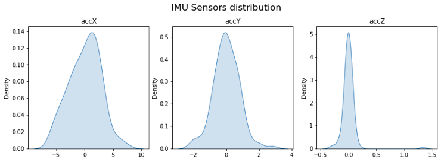

[**Skewness**](https://en.wikipedia.org/wiki/Skewness) is a measure of the asymmetry of a distribution. This value can be positive or negative.


- A negative skew indicates that the tail is on the left side of the distribution, which extends towards more negative values.
- A positive skew indicates that the tail is on the right side of the distribution, which extends towards more positive values.
- A zero value indicates no skewness in the distribution at all, meaning the distribution is perfectly symmetrical.

```python
skew = [skew(x, bias=False) for x in sensors]
[print('skew_'+x+'= ', round(y, 4)) for x,y in zip(axis, skew)][0]
print("\nCompare with Edge Impulse result features")
features[1:N_feat:N_feat_axis]
```

`skew_accX=  -0.099`

`skew_accY=  0.1756`

`skew_accZ=  6.9463`

Compared with Edge Impulse result features:

`[-0.0978, 0.1735, 6.8629]`

[**Kurtosis**](https://en.wikipedia.org/wiki/Kurtosis) is a measure of whether or not a distribution is heavy-tailed or light-tailed relative to a normal distribution.


- The kurtosis of a normal distribution is zero.
- If a given distribution has a negative kurtosis, it is said to be playkurtic, which means it tends to produce fewer and less extreme outliers than the normal distribution.
- If a given distribution has a positive kurtosis , it is said to be leptokurtic, which means it tends to produce more outliers than the normal distribution.

```python
kurt = [kurtosis(x, bias=False) for x in sensors]
[print('kurt_'+x+'= ', round(y, 4)) for x,y in zip(axis, kurt)][0]
print("\nCompare with Edge Impulse result features")
features[2:N_feat:N_feat_axis]
```

`kurt_accX=  -0.3475`

`kurt_accY=  1.2673`

`kurt_accZ=  68.1123`

Compared with Edge Impulse result features:

`[-0.3813, 1.1696, 65.3726]`

## Spectral features

The filtered signal is passed to the Spectral power section, which computes the **FFT** to generate the spectral features.

Since the sampled window is usually larger than the FFT size, the window will be broken into frames (or "sub-windows"), and the FFT is calculated over each frame.

**FFT length** - The FFT size. This determines the number of FFT bins and the resolution of frequency peaks that can be separated. A low number means more signals will average together in the same FFT bin, but it also reduces the number of features and model size. A high number will separate more signals into separate bins, generating a larger model.

- The total number of Spectral Power features will vary depending on how you set the filter and FFT parameters. With No filtering, the number of features is 1/2 of the FFT Length.

**Spectral Power - Welch's method**

We should use [Welch&#39;s method](https://docs.scipy.org/doc/scipy-0.14.0/reference/generated/scipy.signal.welch.html) to split the signal on the frequency domain in bins and calculate the power spectrum for each bin. This method divides the signal into overlapping segments, applies a window function to each segment, computes the periodogram of each segment using DFT, and averages them to obtain a smoother estimate of the power spectrum.

```python
# Function used by Edge Impulse instead of scipy.signal.welch().
def welch_max_hold(fx, sampling_freq, nfft, n_overlap):
    n_overlap = int(n_overlap)
    spec_powers = [0 for _ in range(nfft//2+1)]
    ix = 0
    while ix <= len(fx):
        # Slicing truncates if end_idx > len, and rfft will auto-zero pad
        fft_out = np.abs(np.fft.rfft(fx[ix:ix+nfft], nfft))
        spec_powers = np.maximum(spec_powers, fft_out**2/nfft)
        ix = ix + (nfft-n_overlap)
    return np.fft.rfftfreq(nfft, 1/sampling_freq), spec_powers
```

Applying the above function to 3 signals:

```python
fax,Pax = welch_max_hold(accX, fs, FFT_Lenght, 0)
fay,Pay = welch_max_hold(accY, fs, FFT_Lenght, 0)
faz,Paz = welch_max_hold(accZ, fs, FFT_Lenght, 0)
specs = [Pax, Pay, Paz ]
```

We can plot the Power Spectrum P(f):

```python
plt.plot(fax,Pax, label='accX')
plt.plot(fay,Pay, label='accY')
plt.plot(faz,Paz, label='accZ')
plt.legend(loc='upper right')
plt.xlabel('Frequency (Hz)')
#plt.ylabel('PSD [V**2/Hz]')
plt.ylabel('Power')
plt.title('Power spectrum P(f) using Welch's method')
plt.grid()
plt.box(False)
plt.show()
```

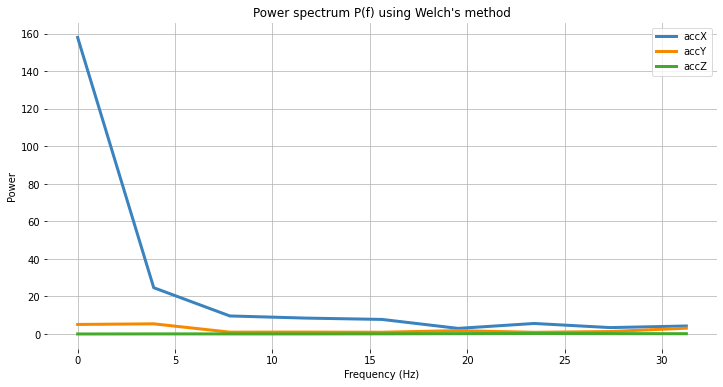

Besides the Power Spectrum, we can also include the skewness and kurtosis of the features in the frequency domain (should be available on a new version):

```python
spec_skew = [skew(x, bias=False) for x in specs]
spec_kurtosis = [kurtosis(x, bias=False) for x in specs]
```

Let's now list all Spectral features per axis and compare them with EI:

```python
print("EI Processed Spectral features (accX): ")
print(features[3:N_feat_axis][0:])
print("\nCalculated features:")
print (round(spec_skew[0],4))
print (round(spec_kurtosis[0],4))
[print(round(x, 4)) for x in Pax[1:]][0]
```

EI Processed Spectral features (accX):

2.398, 3.8924, 24.6841, 9.6303, 8.4867, 7.7793, 2.9963, 5.6242, 3.4198, 4.2735

Calculated features:

2.9069 8.5569 24.6844 9.6304 8.4865 7.7794 2.9964 5.6242 3.4198 4.2736

```python
print("EI Processed Spectral features (accY): ")
print(features[16:26][0:]) #13: 3+N_feat_axis;  26 = 2x N_feat_axis
print("\nCalculated features:")
print (round(spec_skew[1],4))
print (round(spec_kurtosis[1],4))
[print(round(x, 4)) for x in Pay[1:]][0]
```

EI Processed Spectral features (accY):

0.9426, -0.8039, 5.429, 0.999, 1.0315, 0.9459, 1.8117, 0.9088, 1.3302, 3.112

Calculated features:

1.1426 -0.3886 5.4289 0.999 1.0315 0.9458 1.8116 0.9088 1.3301 3.1121

```python
print("EI Processed Spectral features (accZ): ")
print(features[29:][0:]) #29: 3+(2*N_feat_axis);
print("\nCalculated features:")
print (round(spec_skew[2],4))
print (round(spec_kurtosis[2],4))
[print(round(x, 4)) for x in Paz[1:]][0]
```

EI Processed Spectral features (accZ):

0.3117, -1.3812, 0.0606, 0.057, 0.0567, 0.0976, 0.194, 0.2574, 0.2083, 0.166

Calculated features:

0.3781 -1.4874 0.0606 0.057 0.0567 0.0976 0.194 0.2574 0.2083 0.166

## Time-frequency domain

### Wavelets

[Wavelet](https://en.wikipedia.org/wiki/Wavelet) is a powerful technique for analyzing signals with transient features or abrupt changes, such as spikes or edges, which are difficult to interpret with traditional Fourier-based methods.

Wavelet transforms work by breaking down a signal into different frequency components and analyzing them individually. The transformation is achieved by convolving the signal with a **wavelet function**, a small waveform centered at a specific time and frequency. This process effectively decomposes the signal into different frequency bands, each of which can be analyzed separately.

One of the critical benefits of wavelet transforms is that they allow for time-frequency analysis, which means that they can reveal the frequency content of a signal as it changes over time. This makes them particularly useful for analyzing non-stationary signals, which vary over time.

Wavelets have many practical applications, including signal and image compression, denoising, feature extraction, and image processing.

Let's select Wavelet on the Spectral Features block in the same project:

- Type: Wavelet
- Wavelet Decomposition Level: 1
- Wavelet: bior1.3

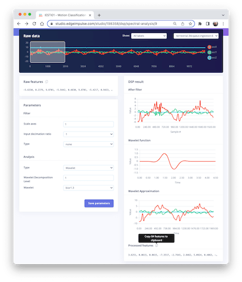

**The Wavelet Function**

```python
wavelet_name='bior1.3'
num_layer = 1

wavelet = pywt.Wavelet(wavelet_name)
[phi_d,psi_d,phi_r,psi_r,x] = wavelet.wavefun(level=5)
plt.plot(x, psi_d, color='red')
plt.title('Wavelet Function')
plt.ylabel('Value')
plt.xlabel('Time')
plt.grid()
plt.box(False)
plt.show()
```

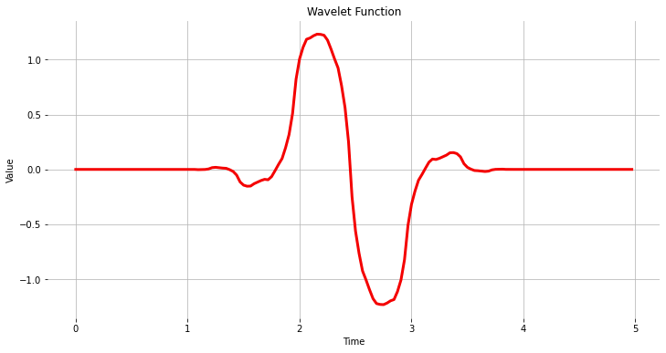

As we did before, let's copy and past the Processed Features:


```python
features = [3.6251, 0.0615, 0.0615, -7.3517, -2.7641, 2.8462, 5.0924, ...]
N_feat = len(features)
N_feat_axis = int(N_feat/n_sensors)
```

Edge Impulse computes the [Discrete Wavelet Transform (DWT)](https://pywavelets.readthedocs.io/en/latest/ref/dwt-discrete-wavelet-transform.html) for each one of the Wavelet Decomposition levels selected. After that, the features will be extracted.

In the case of **Wavelets**, the extracted features are *basic statistical values*, *crossing values*, and *entropy.* There are, in total, 14 features per layer as below:

- \[11\] Statiscal Features: **n5, n25, n75, n95, mean, median,** standard deviation **(std)**, variance **(var)** root mean square **(rms), kurtosis**, and skewness **(skew)**.
- \[2\] Crossing Features: Zero crossing rate **(zcross)** and mean crossing rate **(mcross)** are the times that the signal passes through the baseline (y = 0) and the average level (y = u) per unit of time, respectively
- \[1\] Complexity Feature: **Entropy** is a characteristic measure of the complexity of the signal

All the above 14 values are calculated for each Layer (including L0, the original signal)

- The total number of features varies depending on how you set the filter and the number of layers. For example, with \[None\] filtering and Level\[1\], the number of features per axis will be 14 x 2 (L0 and L1) = 28. For the three axes, we will have a total of 84 features.

### Wavelet Analysis

Wavelet analysis decomposes the signal (**accX, accY**, **and accZ**) into different frequency components using a set of filters, which separate these components into low-frequency (slowly varying parts of the signal containing long-term patterns), such as **accX_l1, accY_l1, accZ_l1** and, high-frequency (rapidly varying parts of the signal containing short-term patterns) components, such as **accX_d1, accY_d1, accZ_d1**, permitting the extraction of features for further analysis or classification.

Only the low-frequency components (approximation coefficients, or cA) will be used. In this example, we assume only one level (Single-level Discrete Wavelet Transform), where the function will return a tuple. With a multilevel decomposition, the "Multilevel 1D Discrete Wavelet Transform", the result will be a list (for detail, please see: [Discrete Wavelet Transform (DWT)](https://pywavelets.readthedocs.io/en/latest/ref/dwt-discrete-wavelet-transform.html) )

```python
(accX_l1, accX_d1) = pywt.dwt(accX, wavelet_name)
(accY_l1, accY_d1) = pywt.dwt(accY, wavelet_name)
(accZ_l1, accZ_d1) = pywt.dwt(accZ, wavelet_name)
sensors_l1 = [accX_l1, accY_l1, accZ_l1]

# Plot power spectrum versus frequency
plt.plot(accX_l1, label='accX')
plt.plot(accY_l1, label='accY')
plt.plot(accZ_l1, label='accZ')
plt.legend(loc='lower right')
plt.xlabel('Time')
plt.ylabel('Value')
plt.title('Wavelet Approximation')
plt.grid()
plt.box(False)
plt.show()
```

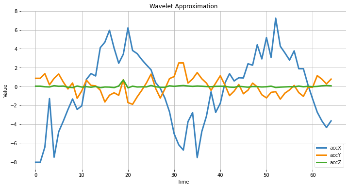

### Feature Extraction

Let's start with the basic statistical features. Note that we apply the function for both the original signals and the resultant cAs from the DWT:

```python
def calculate_statistics(signal):
    n5 = np.percentile(signal, 5)
    n25 = np.percentile(signal, 25)
    n75 = np.percentile(signal, 75)
    n95 = np.percentile(signal, 95)
    median = np.percentile(signal, 50)
    mean = np.mean(signal)
    std = np.std(signal)
    var = np.var(signal)
    rms = np.sqrt(np.mean(np.square(signal)))
    return [n5, n25, n75, n95, median, mean, std, var, rms]

stat_feat_l0 = [calculate_statistics(x) for x in sensors]
stat_feat_l1 = [calculate_statistics(x) for x in sensors_l1]
```

The Skelness and Kurtosis:

```python
skew_l0 = [skew(x, bias=False) for x in sensors]
skew_l1 = [skew(x, bias=False) for x in sensors_l1]
kurtosis_l0 = [kurtosis(x, bias=False) for x in sensors]
kurtosis_l1 = [kurtosis(x, bias=False) for x in sensors_l1]
```

**Zero crossing (zcross)** is the number of times the wavelet coefficient crosses the zero axis. It can be used to measure the signal's frequency content since high-frequency signals tend to have more zero crossings than low-frequency signals.

**Mean crossing (mcross)**, on the other hand, is the number of times the wavelet coefficient crosses the mean of the signal. It can be used to measure the amplitude since high-amplitude signals tend to have more mean crossings than low-amplitude signals.

```python
def getZeroCrossingRate(arr):
    my_array = np.array(arr)
    zcross = float("{0:.2f}".format((((my_array[:-1] * my_array[1:]) < 0).su    m())/len(arr)))
    return zcross

def getMeanCrossingRate(arr):
    mcross = getZeroCrossingRate(np.array(arr) - np.mean(arr))
    return mcross

def calculate_crossings(list):
    zcross=[]
    mcross=[]
    for i in range(len(list)):
        zcross_i = getZeroCrossingRate(list[i])
        zcross.append(zcross_i)
        mcross_i = getMeanCrossingRate(list[i])
        mcross.append(mcross_i)
    return zcross, mcross

cross_l0 = calculate_crossings(sensors)
cross_l1 = calculate_crossings(sensors_l1)
```

In wavelet analysis, **entropy** refers to the degree of disorder or randomness in the distribution of wavelet coefficients. Here, we used Shannon entropy, which measures a signal's uncertainty or randomness. It is calculated as the negative sum of the probabilities of the different possible outcomes of the signal multiplied by their base 2 logarithm. In the context of wavelet analysis, Shannon entropy can be used to measure the complexity of the signal, with higher values indicating greater complexity.

```python
def calculate_entropy(signal, base=None):
    value, counts = np.unique(signal, return_counts=True)
    return entropy(counts, base=base)

entropy_l0 = [calculate_entropy(x) for x in sensors]
entropy_l1 = [calculate_entropy(x) for x in sensors_l1]
```

Let's now list all the wavelet features and create a list by layers.

```python
L1_features_names = ["L1-n5", "L1-n25", "L1-n75", "L1-n95", "L1-median", "L1-mean", "L1-std", "L1-var", "L1-rms", "L1-skew", "L1-Kurtosis", "L1-zcross", "L1-mcross", "L1-entropy"]

L0_features_names = ["L0-n5", "L0-n25", "L0-n75", "L0-n95", "L0-median", "L0-mean", "L0-std", "L0-var", "L0-rms", "L0-skew", "L0-Kurtosis", "L0-zcross", "L0-mcross", "L0-entropy"]

all_feat_l0 = []
for i in range(len(axis)):
    feat_l0 = stat_feat_l0[i]+[skew_l0[i]]+[kurtosis_l0[i]]+[cross_l0[0][i]]+[cross_l0[1][i]]+[entropy_l0[i]]
    [print(axis[i]+' '+x+'= ', round(y, 4)) for x,y in zip(L0_features_names, feat_l0)][0]
    all_feat_l0.append(feat_l0)
all_feat_l0 = [item for sublist in all_feat_l0 for item in sublist]
print(f"\nAll L0 Features = {len(all_feat_l0)}")

all_feat_l1 = []
for i in range(len(axis)):
feat_l1 = stat_feat_l1[i]+[skew_l1[i]]+[kurtosis_l1[i]]+[cross_l1[0][i]]+[cross_l1[1][i]]+[entropy_l1[i]]
[print(axis[i]+' '+x+'= ', round(y, 4)) for x,y in zip(L1_features_names, feat_l1)][0]
all_feat_l1.append(feat_l1)
all_feat_l1 = [item for sublist in all_feat_l1 for item in sublist]
print(f"\nAll L1 Features = {len(all_feat_l1)}")
```

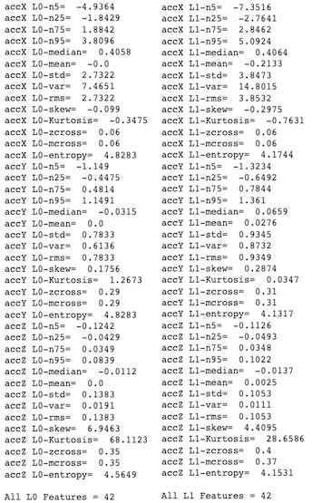

## Conclusion

Edge Impulse Studio is a powerful online platform that can handle the pre-processing task for us. Still, given our engineering perspective, we want to understand what is happening under the hood. This knowledge will help us find the best options and hyper-parameters for tuning our projects.

Daniel Situnayake wrote in his [blog:](https://situnayake.com/) "Raw sensor data is highly dimensional and noisy. Digital signal processing algorithms help us sift the signal from the noise. DSP is an essential part of embedded engineering, and many edge processors have on-board acceleration for DSP. As an ML engineer, learning basic DSP gives you superpowers for handling high-frequency time series data in your models." I recommend you read Dan's excellent post in its totality: [nn to cpp: What you need to know about porting deep learning models to the edge](https://situnayake.com/2023/03/21/nn-to-cpp.html).
