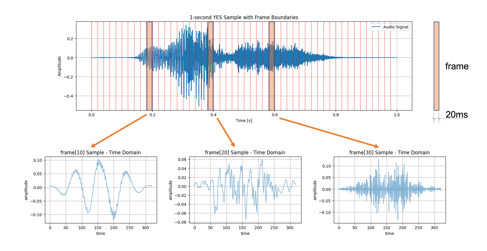
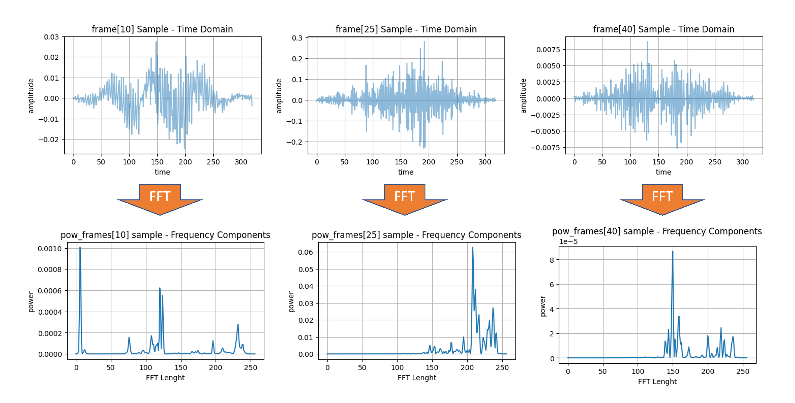
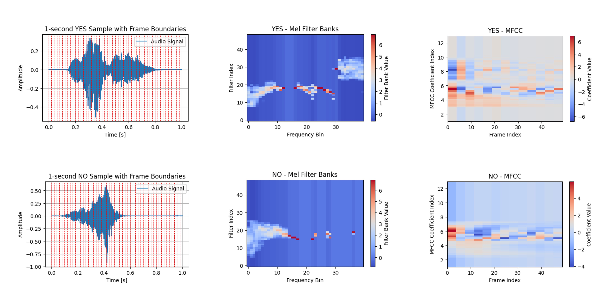

# KWS Feature Engineering

## Overview

In this hands-on tutorial, the emphasis is on the critical role that feature engineering plays in optimizing the performance of machine learning models applied to audio classification tasks, such as speech recognition. It is essential to be aware that the performance of any machine learning model relies heavily on the quality of features used, and we will deal with "under-the-hood" mechanics of feature extraction, mainly focusing on Mel-frequency Cepstral Coefficients (MFCCs), a cornerstone in the field of audio signal processing.

Machine learning models, especially traditional algorithms, don't understand audio waves. They understand numbers arranged in some meaningful way, i.e., features. These features encapsulate the characteristics of the audio signal, making it easier for models to distinguish between different sounds.

> This tutorial will deal with generating features specifically for audio classification. This can be particularly interesting for applying machine learning to a variety of audio data, whether for speech recognition, music categorization, insect classification based on wingbeat sounds, or other sound analysis tasks

## The KWS

The most common TinyML application is Keyword Spotting (KWS), a subset of the broader field of speech recognition. While general speech recognition transcribes all spoken words into text, Keyword Spotting focuses on detecting specific "keywords" or "wake words" in a continuous audio stream. The system is trained to recognize these keywords as predefined phrases or words, such as *yes* or *no*. In short, KWS is a specialized form of speech recognition with its own set of challenges and requirements.

Here a typical KWS Process using MFCC Feature Converter:

### Applications of KWS

- **Voice Assistants:** In devices like Amazon's Alexa or Google Home, KWS is used to detect the wake word ("Alexa" or "Hey Google") to activate the device.
- **Voice-Activated Controls:** In automotive or industrial settings, KWS can be used to initiate specific commands like "Start engine" or "Turn off lights."
- **Security Systems:** Voice-activated security systems may use KWS to authenticate users based on a spoken passphrase.
- **Telecommunication Services:** Customer service lines may use KWS to route calls based on spoken keywords.

### Differences from General Speech Recognition

- **Computational Efficiency:** KWS is usually designed to be less computationally intensive than full speech recognition, as it only needs to recognize a small set of phrases.
- **Real-time Processing:** KWS often operates in real-time and is optimized for low-latency detection of keywords.
- **Resource Constraints:** KWS models are often designed to be lightweight, so they can run on devices with limited computational resources, like microcontrollers or mobile phones.
- **Focused Task:** While general speech recognition models are trained to handle a broad range of vocabulary and accents, KWS models are fine-tuned to recognize specific keywords, often in noisy environments accurately.

## Overview to Audio Signals

Understanding the basic properties of audio signals is crucial for effective feature extraction and, ultimately, for successfully applying machine learning algorithms in audio classification tasks. Audio signals are complex waveforms that capture fluctuations in air pressure over time. These signals can be characterized by several fundamental attributes: sampling rate, frequency, and amplitude.

- **Frequency and Amplitude:** [Frequency](https://en.wikipedia.org/wiki/Audio_frequency) refers to the number of oscillations a waveform undergoes per unit time and is also measured in Hz. In the context of audio signals, different frequencies correspond to different pitches. [Amplitude](https://en.wikipedia.org/wiki/Amplitude), on the other hand, measures the magnitude of the oscillations and correlates with the loudness of the sound. Both frequency and amplitude are essential features that capture audio signals' tonal and rhythmic qualities.
- **Sampling Rate:** The [sampling rate](https://en.wikipedia.org/wiki/Sampling_(signal_processing)), often denoted in Hertz (Hz), defines the number of samples taken per second when digitizing an analog signal. A higher sampling rate allows for a more accurate digital representation of the signal but also demands more computational resources for processing. Typical sampling rates include 44.1 kHz for CD-quality audio and 16 kHz or 8 kHz for speech recognition tasks. Understanding the trade-offs in selecting an appropriate sampling rate is essential for balancing accuracy and computational efficiency. In general, with TinyML projects, we work with 16KHz. Although music tones can be heard at frequencies up to 20 kHz, voice maxes out at 8 kHz. Traditional telephone systems use an 8 kHz sampling frequency.

> For an accurate representation of the signal, the sampling rate must be at least twice the highest frequency present in the signal.

- **Time Domain vs. Frequency Domain:** Audio signals can be analyzed in the time and frequency domains. In the time domain, a signal is represented as a waveform where the amplitude is plotted against time. This representation helps to observe temporal features like onset and duration but the signal's tonal characteristics are not well evidenced. Conversely, a frequency domain representation provides a view of the signal's constituent frequencies and their respective amplitudes, typically obtained via a Fourier Transform. This is invaluable for tasks that require understanding the signal's spectral content, such as identifying musical notes or speech phonemes (our case).

The image below shows the words `YES` and `NO` with typical representations in the Time (Raw Audio) and Frequency domains:

### Why Not Raw Audio?

While using raw audio data directly for machine learning tasks may seem tempting, this approach presents several challenges that make it less suitable for building robust and efficient models.

Using raw audio data for Keyword Spotting (KWS), for example, on TinyML devices poses challenges due to its high dimensionality (using a 16 kHz sampling rate), computational complexity for capturing temporal features, susceptibility to noise, and lack of semantically meaningful features, making feature extraction techniques like MFCCs a more practical choice for resource-constrained applications.

Here are some additional details of the critical issues associated with using raw audio:

- **High Dimensionality:** Audio signals, especially those sampled at high rates, result in large amounts of data. For example, a 1-second audio clip sampled at 16 kHz will have 16,000 individual data points. High-dimensional data increases computational complexity, leading to longer training times and higher computational costs, making it impractical for resource-constrained environments. Furthermore, the wide dynamic range of audio signals requires a significant amount of bits per sample, while conveying little useful information.
- **Temporal Dependencies:** Raw audio signals have temporal structures that simple machine learning models may find hard to capture. While recurrent neural networks like [LSTMs](https://annals-csis.org/Volume_18/drp/pdf/185.pdf) can model such dependencies, they are computationally intensive and tricky to train on tiny devices.
- **Noise and Variability:** Raw audio signals often contain background noise and other non-essential elements affecting model performance. Additionally, the same sound can have different characteristics based on various factors such as distance from the microphone, the orientation of the sound source, and acoustic properties of the environment, adding to the complexity of the data.
- **Lack of Semantic Meaning:** Raw audio doesn't inherently contain semantically meaningful features for classification tasks. Features like pitch, tempo, and spectral characteristics, which can be crucial for speech recognition, are not directly accessible from raw waveform data.
- **Signal Redundancy:** Audio signals often contain redundant information, with certain portions of the signal contributing little to no value to the task at hand. This redundancy can make learning inefficient and potentially lead to overfitting.

For these reasons, feature extraction techniques such as Mel-frequency Cepstral Coefficients (MFCCs), Mel-Frequency Energies (MFEs), and simple Spectograms are commonly used to transform raw audio data into a more manageable and informative format. These features capture the essential characteristics of the audio signal while reducing dimensionality and noise, facilitating more effective machine learning.

## Overview to MFCCs

### What are MFCCs?

[Mel-frequency Cepstral Coefficients (MFCCs)](https://en.wikipedia.org/wiki/Mel-frequency_cepstrum) are a set of features derived from the spectral content of an audio signal. They are based on human auditory perceptions and are commonly used to capture the phonetic characteristics of an audio signal. The MFCCs are computed through a multi-step process that includes pre-emphasis, framing, windowing, applying the Fast Fourier Transform (FFT) to convert the signal to the frequency domain, and finally, applying the Discrete Cosine Transform (DCT). The result is a compact representation of the original audio signal's spectral characteristics.

The image below shows the words `YES` and `NO` in their MFCC representation:

> This [video](https://youtu.be/SJo7vPgRlBQ?si=KSgzmDg8DtSVqzXp) explains the Mel Frequency Cepstral Coefficients (MFCC) and how to compute them.

### Why are MFCCs important?

MFCCs are crucial for several reasons, particularly in the context of Keyword Spotting (KWS) and TinyML:

- **Dimensionality Reduction:** MFCCs capture essential spectral characteristics of the audio signal while significantly reducing the dimensionality of the data, making it ideal for resource-constrained TinyML applications.
- **Robustness:** MFCCs are less susceptible to noise and variations in pitch and amplitude, providing a more stable and robust feature set for audio classification tasks.
- **Human Auditory System Modeling:** The Mel scale in MFCCs approximates the human ear's response to different frequencies, making them practical for speech recognition where human-like perception is desired.
- **Computational Efficiency:** The process of calculating MFCCs is computationally efficient, making it well-suited for real-time applications on hardware with limited computational resources.

In summary, MFCCs offer a balance of information richness and computational efficiency, making them popular for audio classification tasks, particularly in constrained environments like TinyML.

### Computing MFCCs

The computation of Mel-frequency Cepstral Coefficients (MFCCs) involves several key steps. Let's walk through these, which are particularly important for Keyword Spotting (KWS) tasks on TinyML devices.

- **Pre-emphasis:** The first step is pre-emphasis, which is applied to accentuate the high-frequency components of the audio signal and balance the frequency spectrum. This is achieved by applying a filter that amplifies the difference between consecutive samples. The formula for pre-emphasis is: y(t) = x(t) - $\alpha$ x(t-1) , where $\alpha$ is the pre-emphasis factor, typically around 0.97.
- **Framing:** Audio signals are divided into short frames (the *frame length*), usually 20 to 40 milliseconds. This is based on the assumption that frequencies in a signal are stationary over a short period. Framing helps in analyzing the signal in such small time slots. The *frame stride* (or step) will displace one frame and the adjacent. Those steps could be sequential or overlapped.
- **Windowing:** Each frame is then windowed to minimize the discontinuities at the frame boundaries. A commonly used window function is the Hamming window. Windowing prepares the signal for a Fourier transform by minimizing the edge effects. The image below shows three frames (10, 20, and 30) and the time samples after windowing (note that the frame length and frame stride are 20 ms):

- **Fast Fourier Transform (FFT)** The Fast Fourier Transform (FFT) is applied to each windowed frame to convert it from the time domain to the frequency domain. The FFT gives us a complex-valued representation that includes both magnitude and phase information. However, for MFCCs, only the magnitude is used to calculate the Power Spectrum. The power spectrum is the square of the magnitude spectrum and measures the energy present at each frequency component.

> The power spectrum $P(f)$ of a signal $x(t)$ is defined as $P(f) = |X(f)|^2$, where $X(f)$ is the Fourier Transform of $x(t)$. By squaring the magnitude of the Fourier Transform, we emphasize *stronger* frequencies over *weaker* ones, thereby capturing more relevant spectral characteristics of the audio signal. This is important in applications like audio classification, speech recognition, and Keyword Spotting (KWS), where the focus is on identifying distinct frequency patterns that characterize different classes of audio or phonemes in speech.

- **Mel Filter Banks:** The frequency domain is then mapped to the [Mel scale](https://en.wikipedia.org/wiki/Mel_scale), which approximates the human ear's response to different frequencies. The idea is to extract more features (more filter banks) in the lower frequencies and less in the high frequencies. Thus, it performs well on sounds distinguished by the human ear. Typically, 20 to 40 triangular filters extract the Mel-frequency energies. These energies are then log-transformed to convert multiplicative factors into additive ones, making them more suitable for further processing.

- **Discrete Cosine Transform (DCT):** The last step is to apply the [Discrete Cosine Transform (DCT)](https://en.wikipedia.org/wiki/Discrete_cosine_transform) to the log Mel energies. The DCT helps to decorrelate the energies, effectively compressing the data and retaining only the most discriminative features. Usually, the first 12-13 DCT coefficients are retained, forming the final MFCC feature vector.

## Hands-On using Python

Let's apply what we discussed while working on an actual audio sample. Open the notebook on Google CoLab and extract the MLCC features on your audio samples: [\[Open In Colab\]](https://colab.research.google.com/github/SMC-AAU-CPH/SPIS/blob/main/04-SharedLab/Audio_Data_Analysis.ipynb)

## Conclusion

*What Feature Extraction technique should we use?*

Mel-frequency Cepstral Coefficients (MFCCs), Mel-Frequency Energies (MFEs), or Spectrogram are techniques for representing audio data, which are often helpful in different contexts.

In general, MFCCs are more focused on capturing the envelope of the power spectrum, which makes them less sensitive to fine-grained spectral details but more robust to noise. This is often desirable for speech-related tasks. On the other hand, spectrograms or MFEs preserve more detailed frequency information, which can be advantageous in tasks that require discrimination based on fine-grained spectral content.

### MFCCs are particularly strong for

1. **Speech Recognition:** MFCCs are excellent for identifying phonetic content in speech signals.
2. **Speaker Identification:** They can be used to distinguish between different speakers based on voice characteristics.
3. **Emotion Recognition:** MFCCs can capture the nuanced variations in speech indicative of emotional states.
4. **Keyword Spotting:** Especially in TinyML, where low computational complexity and small feature size are crucial.

### Spectrograms or MFEs are often more suitable for

1. **Music Analysis:** Spectrograms can capture harmonic and timbral structures in music, which is essential for tasks like genre classification, instrument recognition, or music transcription.
2. **Environmental Sound Classification:** In recognizing non-speech, environmental sounds (e.g., rain, wind, traffic), the full spectrogram can provide more discriminative features.
3. **Birdsong Identification:** The intricate details of bird calls are often better captured using spectrograms.
4. **Bioacoustic Signal Processing:** In applications like dolphin or bat call analysis, the fine-grained frequency information in a spectrogram can be essential.
5. **Audio Quality Assurance:** Spectrograms are often used in professional audio analysis to identify unwanted noises, clicks, or other artifacts.

## Resources

- [Audio_Data_Analysis Colab Notebook](https://colab.research.google.com/github/SMC-AAU-CPH/SPIS/blob/main/04-SharedLab/Audio_Data_Analysis.ipynb)
